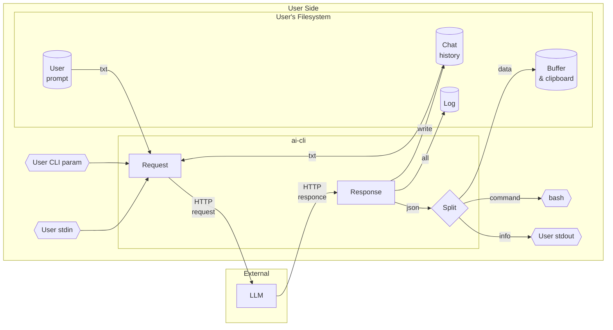

# AI CLI Assistant

1. Prototype of CLI utility designed for embedding AI into bash pipelines
0. Usage:
    1. `echo "hello world" | 1` - pipeline;
    0. `1 create hello-world folder` - direct query to AI;
    0. `1` - interactive query input;

* [How it works](#how-it-works)
* [Why ai-cli](#why-ai-cli)
* [Supported AI Providers](#supported-ai-providers)
* [Build Instructions](#build-instructions)
* [Run](#run)
* [Security](#security)
* [Architecture](#architecture)


# How it works

1. User provides input via arguments or pipeline
2. AI generates a response
3. The utility **types the response into your terminal** (X11 keyboard emulation)
4. You can **edit the command** freely using standard line editing keys
5. Press Enter to execute the final command

```
user@comp:~$ 1 hello
Hello! How can I assist you today?
user@comp:~$ 1 show me files in current directory
Here are the files and directories in the current directory:
user@comp:~$ ls -la
```

"Would you press enter?"

```
flowchart LR
    gate{+}
    buffer[file & clipboard] 
    user[users \n 'enter']
    stdin --> ai --> gate--> stdout & keyboard & buffer
    keyboard --> user --> bash
```

# Why `ai-cli`

1. **Standard Bash and Unix utilities** — No Node.js, no Python, no Docker. Works 
with `cat`, `tee`, `xclip`, `nano`, `vi`, `git` — everything already on your 
system.
2. **Minimal dependencies** — Single ~900KB static binary. No runtime, no package 
manager, no interpreter.
3. **Full user control** — AI **never** executes commands. Command appears on 
your keyboard → you edit → you press Enter → bash executes. No background agent. 
No daemon. No permission popups. Just your terminal.
4. **User defines output destinations** — `in`, `out`, `buffer` — each can be 
sent to stdout, file, clipboard, TTY, or any custom command. You decide where AI 
output goes.

**Compare:**

- [Claude Code](https://docs.anthropic.com/en/docs/claude-code) — can run shell commands automatically (with "auto mode")
- [Codex CLI](https://github.com/openai/openai-codex) — has Auto/Read-only/Full Access modes, can execute without confirmation
- [Gemini CLI](https://github.com/google-gemini/gemini-cli) — has "Yolo mode" that bypasses confirmations
- [Shell-GPT](https://github.com/TheR1D/shell_gpt) — can execute commands with `--execute` flag
- [Aider](https://github.com/paul-gauthier/aider) — autonomous agent that writes and executes code

**ai-cli** — only you press Enter... and that’s all that matters.


## Supported AI Providers

1. Currently `ai` works with the following providers:

- `github` — ✅ implemented (default)
- `openai` — ⏳ coming soon
- `deepseek` — ⏳ coming soon
- `groq` — ⏳ coming soon
- `together` — ⏳ coming soon
- `local` (Ollama) — ⏳ coming soon
- `anthropic` (Claude) — ⏳ coming soon


# Build Instructions

1. You can build and install `ai` manually.


## Prerequisites

1. Linux (Ubuntu 20.04+ or Debian 11+) — or newer
2. Install Rust and Cargo:
 
```bash
curl --proto '=https' --tlsv1.2 -sSf https://sh.rustup.rs | sh
source ~/.cargo/env
```

## Clone project

```bash
git clone https://github.com/johnthesmith/ai-cli.git
cd ai-cli
```

## Build

1. Debug build (with debug symbols):

```bush
./make-debug.sh
```

2. Release build (optimized, stripped):

```bash
./make-release.sh
```

## Setup

1. Put `ai` in to `~/.local/bin`.
```bash
mkdir -p ~/.local/bin
cp target/release/ai ~/.local/bin/ai
```
2. Add to your `~/.bashrc`
```
# AI settings
export PATH="$HOME/.local/bin:$PATH"
ln -sf ~/.local/bin/ai ~/.local/bin/1
complete -W "--help --show-info --show-chat --switch-chat --show-history --clear-history --profile --switch-profile=" 1
complete -W "--help --show-info --show-chat --switch-chat --show-history --clear-history --profile --switch-profile=" ai
```
3. Restart your bash.


## Config

1. Copy config for `default` profile.

```bash
mkdir -p ~/.config/ai/default/
cp -r ./config/* ~/.config/ai/default/
```
2. You can:
    1. use proxy;
    0. send bash commands to keyboard, tty, stdout or file;
    0. change prompt;
    0. switch profile.
3. For all options see `~/.config/ai/default/`.


## GitHub Token Setup

1. Go to: https://github.com/settings/personal-access-tokens
2. Click **Generate new token** → **Fine-grained token**
3. Fill:
   - **Token name**: `ai-cli`
   - **Expiration**: 90 days
   - **Resource owner**: your account
4. **Repository access**: `Public Repositories (read-only)`
5. **Permissions** → **Models** → `Read-only`
6. Click **Generate token**
7. **Copy token immediately** (shown only once)
8. Put your github token here `~/.config/local/ai/default/token.txt`


# Run

```bash
1 your question
```


## Usage Information

```
--no-prompt                 Suppress input prompt
--show-info                 Show current runtime information (profile, chat, log, config
--show-chat                 Show current chat id
--switch-chat=<id>          Switch to chat <id>, default id is default
--show-history              Show history for current chat
--clear-history             Remove history for current chat
--profile=<name>            Use profile for current session only
--switch-profile=<name>     Switch and save profile
--write-buffer              Write stdin to buffer file (see buffer_path in config
--tiocsti                   Inject input directly into TTY input buffer for ssh
```


# LLM Response Contract

The AI assistant returns strict JSON. The full format description and rules are 
in the prompt file:

👉 **[prompt.txt](https://github.com/johnthesmith/ai-cli/blob/main/config/prompt.txt)**

## Field Summary

| Field     | Type      | Purpose |
|-|-|-|
| `out`     | `string`  | Human-readable response to user (STDOUT) |
| `command` | `string`  | Bash command for terminal (optional) |
| `buffer`  | `string`  | Data/code, saved to file |

## Main Rules

- `out` — brief response, max 80 chars per line;
- `command` — command is **NOT executed automatically**, only appears in input line. No `\n`, no code blocks;
- `buffer` — for large data. Reference via `%buffer%`;
- `| ai` — only for non-interactive commands with predictable output.

## Response Example

```json
{
  "out": "Listing files in current directory",
  "command": "ls -la",
  "buffer": ""
}
```


# Security

⚠️ **IMPORTANT: This utility can execute shell commands generated by AI.**

- Always review the command printed in your terminal before pressing Enter.
- The AI may generate dangerous commands (e.g., `rm -rf /*`, `dd`, `sudo`).
- **Never execute commands you don't understand or trust.**
- This utility does NOT automatically execute commands — you must press Enter to confirm.

## Recommendations

1. Run with minimal privileges (avoid `sudo` unless absolutely necessary).
2. Keep backups of important data.
3. Test commands in a virtual machine or container first.

## Liability

**The author assumes no responsibility for data loss or system damage.** You are 
using this tool at your own risk.

## For developers

1. Look at [ai.rs](https://github.com/johnthesmith/ai-cli/blob/main/src/ai.rs) 
label REMOVE_ENTER.


# Architecture




