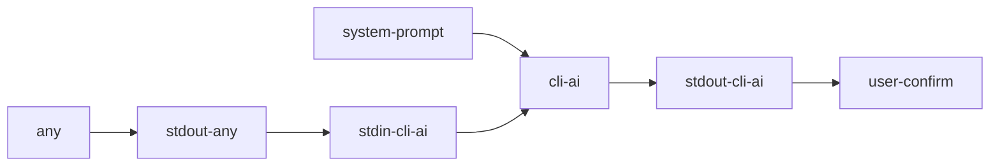

# Утилита cli-ai

1. Утилита предназначена для встраивания ai в bash pipeline
2. Использование:
    1. ```echo "что думаешь про погоду" | cli-ai```
    2. ```echo "создай мне папку a" | cli-ai -e``` 

# Диаграмма




# Ключи

1. `-e` | `--execute` - выполнить вывод утилиты;
2. `-p` | `--propmpt` - указать системный промпт.
