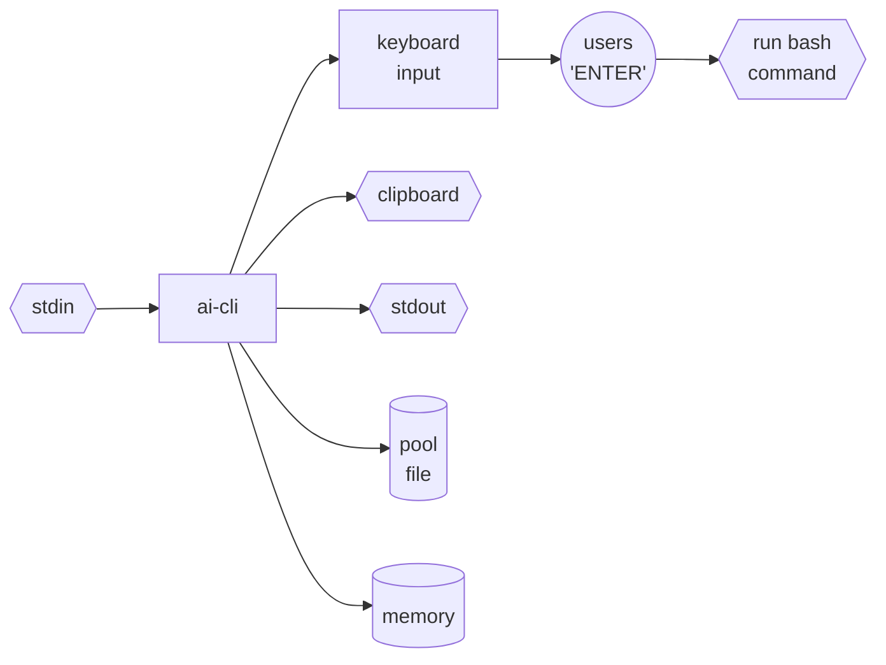
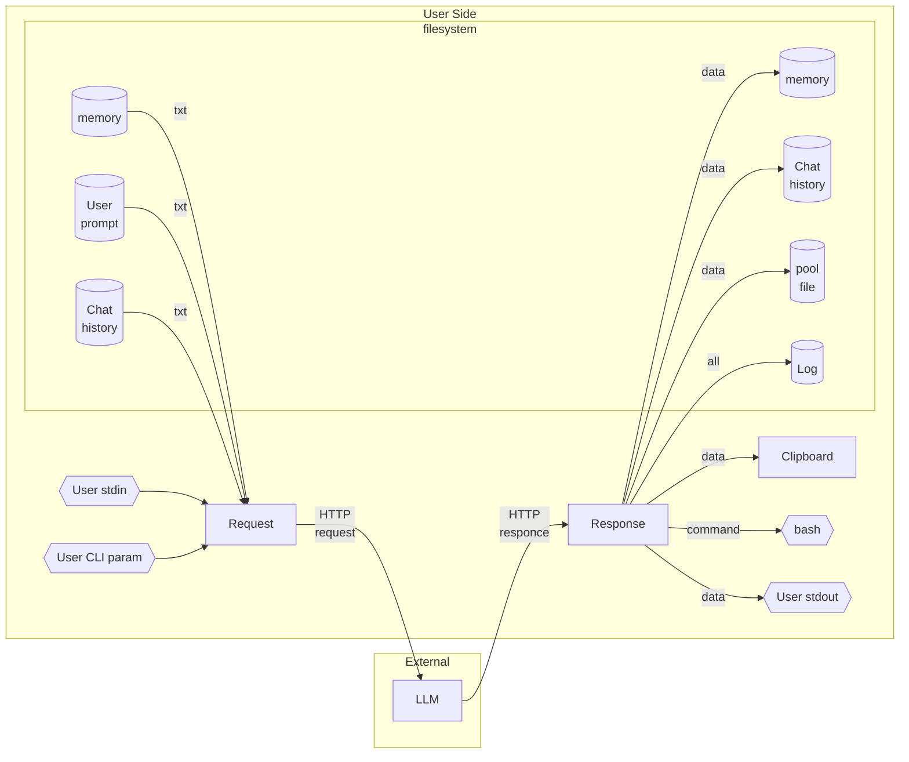

# AI CLI Assistant

1. CLI utility designed for embedding AI into bash pipelines
0. Usage:
    1. `echo "hello world" | 1` - pipeline;
    0. `1 create hello-world folder` - direct query to AI;
    0. `1` - interactive query input;

---

* [Philosophy](#philosophy)
* [How it works](#how-it-works)
* [Why ai-cli](#why-ai-cli)
* [Supported AI Providers](#supported-ai-providers)
* [Liability](#liability)
* [Build](#build)
* [Configuration](#configuration)
* [Run](#run)
* [Security](#security)
* [For developers](#for-developers)
* [Automnemomorph](#automnemomorph)
* [Fact Protocol](#fact-protocol)
* [Architecture](#architecture)

# Philosophy

**LLM decides. Human acts.**

# How it works

1. User provides input via arguments or pipeline
2. AI generates a response
3. The utility **types the response into your terminal** (X11 keyboard emulation)
4. You can **edit the command** freely using standard line editing keys
5. Press Enter to execute the final command



```
user@comp:~$ 1 hello
Hello! How can I assist you today?
user@comp:~$ 1 show me files in current directory
Here are the files and directories in the current directory:
user@comp:~$ ls -la
```

Would you press Enter, or try something else?

```
echo "hello world" | ai "say it for groq" --provider=openai | ai "grok"
```


# Why `ai-cli`

1. **No bloat** — No Node.js, no Python, no Docker. Core works with POSIX tools
(`cat`, `tee`, `grep`). All extras (`xclip`, `git`, `nano`) are **optional**.
2. **Minimal dependencies** — Single static binary. No runtime, no package
manager, no interpreter.
3. **Full user control** — AI **never** executes commands. Command appears on
your keyboard → you edit → you press Enter → bash executes. No background agent.
No daemon. No permission popups. Just your terminal.
4. **User defines output destinations** — each can be sent to stdout, pool
file, clipboard, TTY, or any custom command. You decide where AI output goes.
5. **Unix way** — Everything is a file or a pipe. Configuration is plain YAML in
`~/.config/ai/`. History is plain text in `~/.local/share/ai/`. pool is plain
text. No databases, no registries, no hidden state.

**Compare:**

- [Claude Code](https://docs.anthropic.com/en/docs/claude-code) — can run shell
commands automatically (with "auto mode")
- [Codex CLI](https://github.com/openai/openai-codex) — has Auto/Read-only/Full
Access modes, can execute without confirmation
- [Gemini CLI](https://github.com/google-gemini/gemini-cli) — has "Yolo mode"
that bypasses confirmations
- [Shell-GPT](https://github.com/TheR1D/shell_gpt) — can execute commands with
`--execute` flag
- [aichat](https://github.com/sigoden/aichat) — can execute commands with
`--execute` flag
- [Aider](https://github.com/paul-gauthier/aider) — autonomous agent that writes
and executes code

`ai-cli` — only you press Enter... and that’s all that matters.


## Supported AI Providers

1. Currently `ai` works with the following providers:

- `github` — implemented (default)
- `openai` — testing
- `deepseek` — testing
- `groq` — testing
- `local` — testing (Ollama)
- `anthropic` — coming soon
- `together` — coming soon


# Liability

**The author assumes no responsibility for data loss or system damage.** You are
using this tool at your own risk.


# Install

1. If you have existing configuration from previous versions, remove it before
installation. Otherwise, new configuration files will NOT be created and you may
experience issues.
2. Run
```
curl -fsSL https://raw.githubusercontent.com/johnthesmith/ai-cli/main/install.sh | bash
```
3. Binary files: https://github.com/johnthesmith/ai-cli/releases/latest


# Build

1. This is an alternative to [Install](#install).
2. Requirements for building:
    1. `linux` - (Ubuntu 20.04+, Debian 11+, or newer)
    0. `git`
    0. `curl`
    0. `build-essential`
3. Download and run instalation script:

```
sudo apt install git curl build-essential
curl -fsSL https://raw.githubusercontent.com/johnthesmith/ai-cli/main/build.sh > build.sh
less build.sh
chmod +x build.sh
./build.sh
source ~/.bashrc
```


# Configuration

1. On first run, default config will be created at
`~/.config/ai/default/config.yaml` from
[config](https://github.com/johnthesmith/ai-cli/blob/main/src/ai/config.rs)
2. Tokens will be placed in `~/.config/ai/default/tokens/<provider>.txt`
3. For Git token retrieval see [Git token](./man/git-toke.md).
4. Following the
[AI Config Standard Proposal](https://github.com/johnthesmith/scraps/blob/main/en/proposal_ai_config_standard.md)


# Run

```bash
1 --help
1 hello
```


# Security

⚠️  **IMPORTANT**: This utility does NOT execute commands automatically.

- Always review the command printed in your terminal before pressing Enter.
- The AI may generate dangerous commands (e.g., `rm -rf /*`, `dd`, `sudo`).
- Never execute commands you don't understand.
- This utility does NOT automatically execute commands — you must press
Enter to confirm.
- Recursive `ai|ai` pipelines may cause the tool to hang, but **cannot execute
commands without your approval** — AI never presses Enter for you.


## Recommendations

1. Run with minimal privileges (avoid `sudo` unless absolutely necessary).
2. Keep backups of important data.
3. Test commands in a virtual machine or container first.


## For developers

1. Look at [ai.rs](https://github.com/johnthesmith/ai-cli/blob/main/src/ai.rs).
2. Search for `REMOVE_ENTER` — shows where newlines are stripped from
AI-generated commands (security: prevents auto-execution)


# Automnemomorph

See
[automnemomorph](https://github.com/johnthesmith/scraps/blob/main/en/automnemomorph.md)
for the full concept and philosophical background. Unlike a human, who cannot
"unsee" the past, auto-mnemomorph can:
- Rewrite history (correct mistakes, remove insignificant details)
- Forget on its own initiative
- Add facts

**Enable:**

```
ai --switch-prompt=automnemomorf
```

```yaml
access:
  history: "cud"
  memory: "cud"
  prompt: "cud"
```

**Disable:**

```
ai --switch-prompt=default
```

```yaml
access:
  history: "c"
  memory: "c"
  prompt: "r"
```


# Fact Protocol

The AI assistant must return strict block structure. The full format
description and rules are in the
[prompt file](https://github.com/johnthesmith/ai-cli/blob/main/src/ai/prompts.rs)

AI communicates using named blocks instead of JSON. Each block represents a
single fact or operation. Both user requests and AI responses follow the same
fact block structure. This creates a uniform way to represent all information.


## Why not json

JSON requires escaping quotes and newlines inside strings. LLMs often produce
invalid JSON — missing commas, unescaped quotes, broken multiline strings. Fact
blocks need no escaping, work naturally with multiline content, and LLMs
generate them correctly.


## How LLM Operates

1. Receives history as list of facts
2. Each fact has id, type, actor, action, content
3. LLM can add, remove, or change any fact
4. Returns new facts in same format
5. No special parsing — facts are facts


## Benefits

1. User and AI speak same language over cli
2. History, memory, prompt is just list of facts
3. LLM naturally manipulates facts
4. Full automnemomorph behavior


# Architecture


