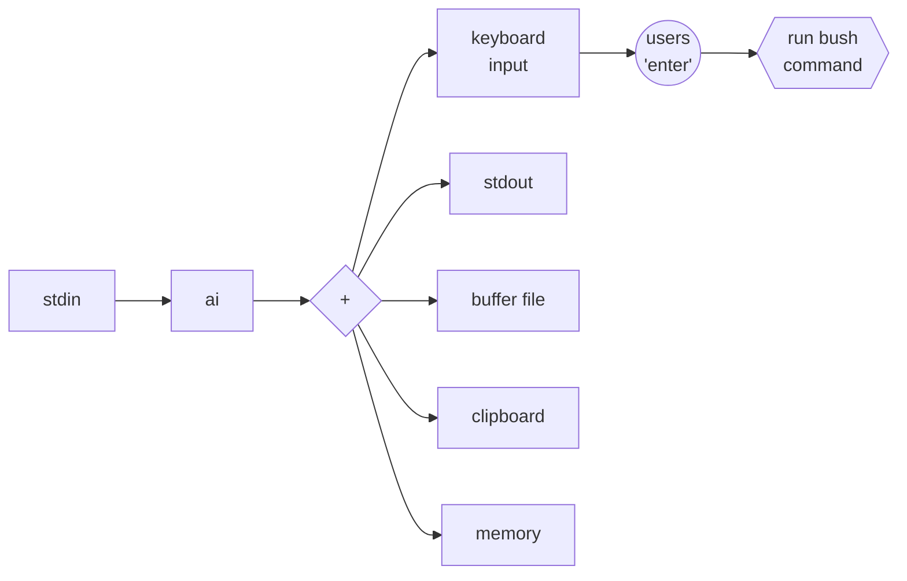
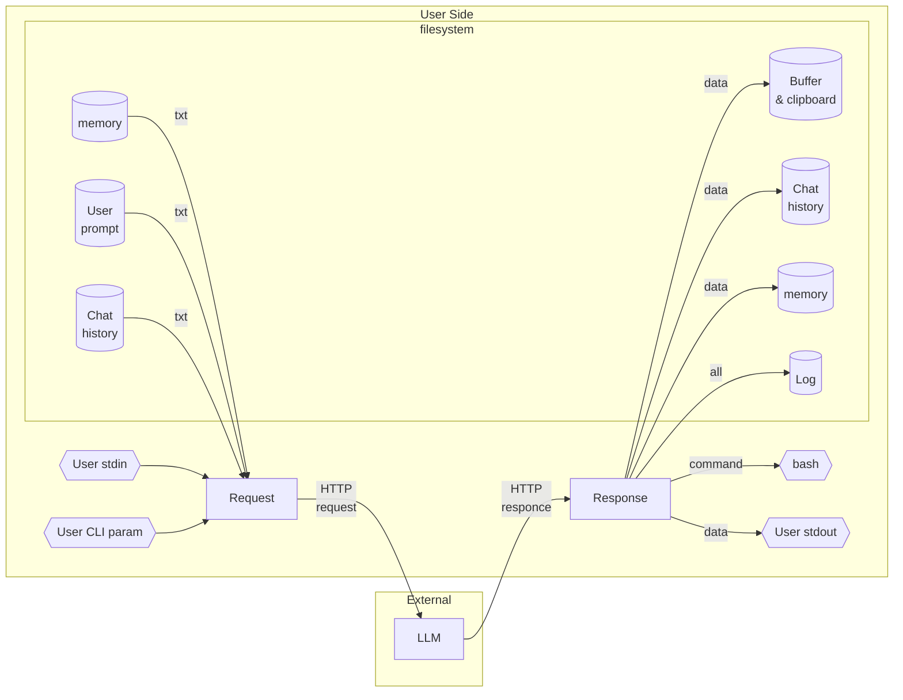

# AI CLI Assistant

1. Prototype of CLI utility designed for embedding AI into bash pipelines
0. Usage:
    1. `echo "hello world" | 1` - pipeline;
    0. `1 create hello-world folder` - direct query to AI;
    0. `1` - interactive query input;

* [How it works](#how-it-works)
* [Why ai-cli](#why-ai-cli)
* [Supported AI Providers](#supported-ai-providers)
* [Liability](#liability)
* [Build](#build)
* [Configuration](#configuration)
* [Run](#run)
* [Security](#security)
* [For developers](#for-developers)
* [Architecture](#architecture)


# How it works

1. User provides input via arguments or pipeline
2. AI generates a response
3. The utility **types the response into your terminal** (X11 keyboard emulation)
4. You can **edit the command** freely using standard line editing keys
5. Press Enter to execute the final command



```
user@comp:~$ 1 hello
Hello! How can I assist you today?
user@comp:~$ 1 show me files in current directory
Here are the files and directories in the current directory:
user@comp:~$ ls -la
```

Would you press Enter, or try something else?

```
echo "hello world" | ai "say it for groq" --provider=openai | ai "grok"
```


# Why `ai-cli`

1. **No bloat** — No Node.js, no Python, no Docker. Core works with POSIX tools 
(`cat`, `tee`, `grep`). All extras (`xclip`, `git`, `nano`) are **optional**.
2. **Minimal dependencies** — Single static binary. No runtime, no package 
manager, no interpreter.
3. **Full user control** — AI **never** executes commands. Command appears on 
your keyboard → you edit → you press Enter → bash executes. No background agent. 
No daemon. No permission popups. Just your terminal.
4. **User defines output destinations** — `in`, `out`, `buffer` — each can be 
sent to stdout, file, clipboard, TTY, or any custom command. You decide where AI 
output goes.
5. **Unix way** — Everything is a file or a pipe. Configuration is plain YAML in 
`~/.config/ai/`. History is plain text in `~/.local/share/ai/`. Buffer is plain 
text. No databases, no registries, no hidden state.

**Compare:**

- [Claude Code](https://docs.anthropic.com/en/docs/claude-code) — can run shell 
commands automatically (with "auto mode")
- [Codex CLI](https://github.com/openai/openai-codex) — has Auto/Read-only/Full 
Access modes, can execute without confirmation
- [Gemini CLI](https://github.com/google-gemini/gemini-cli) — has "Yolo mode" 
that bypasses confirmations
- [Shell-GPT](https://github.com/TheR1D/shell_gpt) — can execute commands with 
`--execute` flag
- [Aider](https://github.com/paul-gauthier/aider) — autonomous agent that writes 
and executes code

`ai-cli` — only you press Enter... and that’s all that matters.


## Supported AI Providers

1. Currently `ai` works with the following providers:

- `github` — implemented (default)
- `openai` — testing
- `deepseek` — testing
- `groq` — testing
- `anthropic` — coming soon
- `together` — coming soon
- `local` (Ollama) — coming soon


# Liability

**The author assumes no responsibility for data loss or system damage.** You are 
using this tool at your own risk.


# Build

1. Requirements for building:
    1. `linux` - (Ubuntu 20.04+, Debian 11+, or newer)
    0. `git` - to clone the repository
    0. `curl`
    0. `build-essential`
    0. `pkg-config`
    0. `libssl-dev`
2. Download and run instalation script:

```
sudo apt install git curl build-essential pkg-config libssl-dev
curl -fsSL https://raw.githubusercontent.com/johnthesmith/ai-cli/main/build.sh > build.sh
less build.sh
chmod +x build.sh
./build.sh
source ~/.bashrc
```


# Configuration

1. Default configuration located at 
[config/config.yaml](https://github.com/johnthesmith/ai-cli/blob/main/config/config.yaml) 
for all providers, prompts, and output destinations.
2. This file must be located at `~/.config/ai/<profile>`.
3. For Git token retrieval see [Git token](./man/git-toke.md).


# Run

```bash
1 your question
```


## Usage options

```
--help                      This information
--no-prompt                 Suppress input prompt
--no-command                Suppress command event 
--show-info                 Show current runtime information (profile, chat, log, config)
--profile=<name>            Use profile for current session only
--switch-profile=<name>     Switch and save profile
--switch-provider=<name>    Switch to AI provider <name> (saves to file)
--provider=<name>           Use provider for current session only (no save)
--switch-chat=<id>          Switch to chat <id>, default id is default
--show-history              Show history for current chat
--clear-history             Remove history for current chat
--pack-history=<percent>    Pack current chat history with 0-100 percent (default: 50)
--show-memory               Show memory for current chat
--clear-memory              Remove memory for current chat (global if %chat% not used)
--write-buffer              Write stdin to buffer file and forward to stdout
--tiocsti                   Inject input directly into TTY input buffer for keyboard
```


# LLM Response Contract

The AI assistant returns strict JSON. The full format description and rules are 
in the prompt file: 
[prompt.txt](https://github.com/johnthesmith/ai-cli/blob/main/config/prompt.txt)


# Security

⚠️  **IMPORTANT: This utility does NOT execute commands automatically.**

- Always review the command printed in your terminal before pressing Enter.
- The AI may generate dangerous commands (e.g., `rm -rf /*`, `dd`, `sudo`).
- Never execute commands you don't understand or trust.
- This utility does NOT automatically execute commands — you must press Enter to 
confirm.
- Recursive `ai|ai` pipelines may cause the tool to hang, but **cannot execute 
commands without your approval** — AI never presses Enter for you.

## Recommendations

1. Run with minimal privileges (avoid `sudo` unless absolutely necessary).
2. Keep backups of important data.
3. Test commands in a virtual machine or container first.


# For developers

1. Look at [ai.rs](https://github.com/johnthesmith/ai-cli/blob/main/src/ai.rs)
   - Search for `REMOVE_ENTER` — shows where newlines are stripped from AI-generated commands (security: prevents auto-execution)


# Architecture




