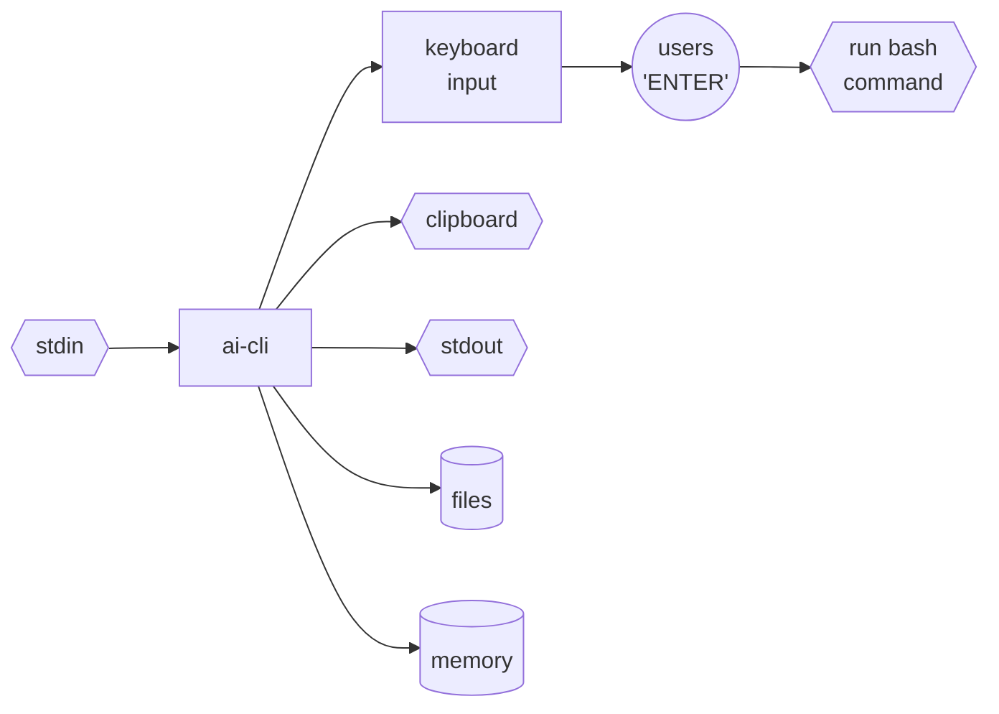
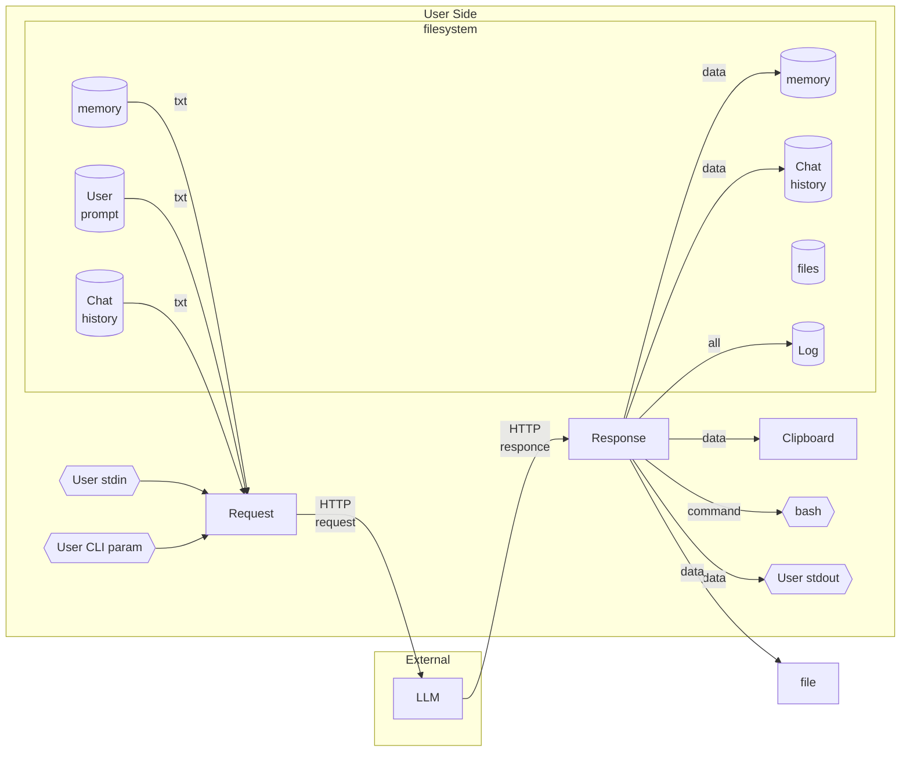

# AI CLI Assistant

1. ai-cli utility designed for embedding LLM into bash pipelines.
0. Usage:
    1. `echo "who are you?" | ai` - pipeline;
    0. `ai create hello-world folder` - direct query to AI;
    0. `ai` - interactive query input;
0. See other [examples and cases](./man/cases.md).

---

* [Philosophy](#philosophy)
* [How it works](#how-it-works)
* [Why ai-cli](#why-ai-cli)
* [Supported AI Providers](#supported-ai-providers)
* [Liability](#liability)
* [Build](#build)
* [Configuration](#configuration)
* [Run](#run)
* [Security](#security)
* [For developers](#for-developers)
* [Automnemomorph](#automnemomorph)
* [Fact Protocol](#fact-protocol)
* [Architecture](#architecture)


# Philosophy

Cooperation over replacement. LLMs assist. Humans decide.


# How it works

1. You provide input: text, files, or commands
2. AI advises: responds, suggests, or transforms
3. You decide: type, copy, write to file, or execute



```
user@comp:~$ ai hello
Hello! How can I assist you today?
user@comp:~$ ai show me files in current directory
Here are the files and directories in the current directory:
user@comp:~$ ls -la
```

Would you press Enter?

```
echo who are you | ai --provider=deepseek it was deepseek
```

It is pipeline.


# Why `ai-cli`

We needed the simple tool for each day working on "smart-iron".

1. **No bloat** — No Node.js, no Python, no Docker. Core works with POSIX tools
(`cat`, `tee`, `grep`). All extras (`xclip`, `git`, `nano`) are **optional**.
2. **Minimal dependencies** — Single static binary. No runtime, no package
manager, no interpreter.
3. **Full control** — AI **never** executes commands. Command appears on
your keyboard → you edit → you press Enter → bash executes. No background agent.
No daemon. No permission popups. Just your and terminal.
4. **User defines output destinations** — each can be sent to stdout, files,
clipboard, TTY, or any custom command. You decide where AI output goes.
5. **Unix way** — Everything is a file or a pipe. Configuration is plain YAML.
[History](./man/history.md) [memory](./man/memory.md) and
[prompt](./man/prompts.md) is plain text. No databases, no registries, no
hidden state.


## Compare

- [Claude Code](https://docs.anthropic.com/en/docs/claude-code) — can run shell
commands automatically (with "auto mode")
- [Codex CLI](https://github.com/openai/openai-codex) — has Auto/Read-only/Full
Access modes, can execute without confirmation
- [Gemini CLI](https://github.com/google-gemini/gemini-cli) — has "Yolo mode"
that bypasses confirmations
- [Shell-GPT](https://github.com/TheR1D/shell_gpt) — can execute commands with
`--execute` flag
- [aichat](https://github.com/sigoden/aichat) — can execute commands with
`--execute` flag
- [Aider](https://github.com/paul-gauthier/aider) — autonomous agent that writes
and executes code


## Supported AI Providers

1. Currently `ai` works with the following providers:

- `github` — implemented (default)
- `deepseek` — implemented
- `openai` — testing
- `groq` — testing
- `ollama` — testing
- `anthropic` — coming soon
- `together` — coming soon


# Liability

**The author assumes no responsibility for data loss or system damage.** You are
using this tool at your own risk.


# Install

1. If you have existing configuration from previous versions, remove it before
installation. Otherwise, new configuration files will NOT be created and you may
experience issues.
2. Run
```
curl -fsSL https://raw.githubusercontent.com/johnthesmith/ai-cli/main/install.sh | bash
```
3. Binary files: https://github.com/johnthesmith/ai-cli/releases/latest


# Configuration

1. ai-cli works like git and places files in the `./.ai-cli` folder.
2. [Tokens](./man/token.md) will be placed in
`~/.config/ai/app/cli/<profile>/<provider>.txt` where default values for:
    1. `<profile>` default
    2. `<provider>` github
3. For Git token retrieval see [Git token](./man/token.md#github).
4. For more information look [configuration](./man/config.md).


# Init and run

```bash
ai --init
```
After init, all files and config will be created in `./.ai-cli/`.

```bash
ai who are you?
```

You are able to switch fluently between chats, memory, prompts for each session
or pipeline.

Get help:
```
ai --help
```


# Security

**IMPORTANT**: This utility does NOT execute commands automatically.

- Always review the command printed in your terminal before pressing Enter.
- The AI may generate dangerous commands (e.g., `rm -rf /*`, `dd`, `sudo`).
- Never execute commands you don't understand.
- This utility does NOT automatically execute commands — you must press
Enter to confirm.
- Recursive `ai|ai` pipelines may cause the tool to hang, but **cannot execute
commands without your approval** — AI never presses Enter for you.


## Files

1. Utility can read your files with arguments `--read=<file>` and write with
`--write=<file>`.
2. For example you could use:
```
ai --read=./README.md --write=./README.ch.md translate readme to chinese
```
3. File operations can be actively used for analyzing and developing code
without agent functions on your device.


## Recommendations

1. Run with minimal privileges (avoid `sudo` unless absolutely necessary).
2. Keep backups of important data.
3. Test commands in a virtual machine or container first.


## For developers

1. Look at [ai.rs](https://github.com/johnthesmith/ai-cli/blob/main/src/ai.rs).
2. Search for `REMOVE_ENTER` — shows where newlines are stripped from
AI-generated commands (security: prevents auto-execution)


# Automnemomorph

ai-cli works as [automnemomorph](./man/automnemomorph.md) by default. See for
the full concept and philosophical background.

# Fact Protocol

The AI assistant must exchange strict [fact](./man/fact.md) structure. The full
format description and rules are in the
`./.ai-cli/chats/<current-chat>/prompts/<current-prompt>.txt`

Both user requests and AI responses follow the same fact block structure. This
creates a uniform way to represent all information. You can absolutely free to
change all facts in the text file.


## How LLM Operates

1. Receives facts from [prompt](./man/prompts.md), [history](./man/history.md)
and [memory](./man/memory.md).
3. LLM can add, remove, or change any fact
4. Returns facts in same format
5. ai-cli tool process the facts and stores it.


## Benefits

1. User and AI speak same language over cli
3. LLM naturally manipulates facts
4. Full automnemomorph behavior


# Architecture




# Authors

1. still@catlair.net collab with igorptx@gmail.com
