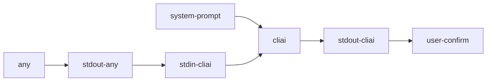

# Утилита ai

1. Утилита предназначена для встраивания ai в bash pipeline
2. Использование:
    1. ```echo "что думаешь про погоду" | ai```
    2. ```ai "создай мне папку a"``` 

# Диаграмма




# Ключи

1. `--clear` - очистить историю чата;
2. `--chat=<id>` - переключится в другой чат;
2. `--help` - вывод помощи.
