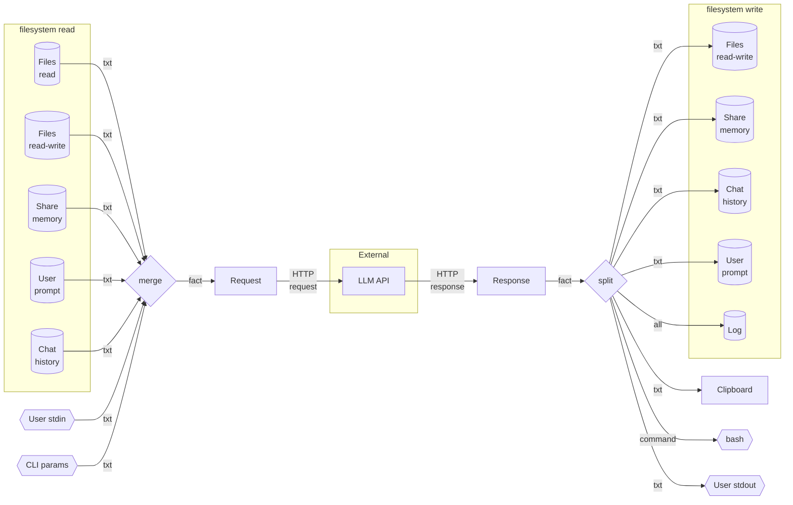

# Architecture

1. ai-cli interacts with the LLM based on the [fact](fact.md) protocol.

## Overview

1. ai-cli collects incoming text data and converts it into facts
2. facts are combined into a text request and sent to the LLM
3. the LLM response is parsed into facts
4. facts are distributed across domains
5. actions are performed on the resulting list of facts to save or apply them

## Diagram

