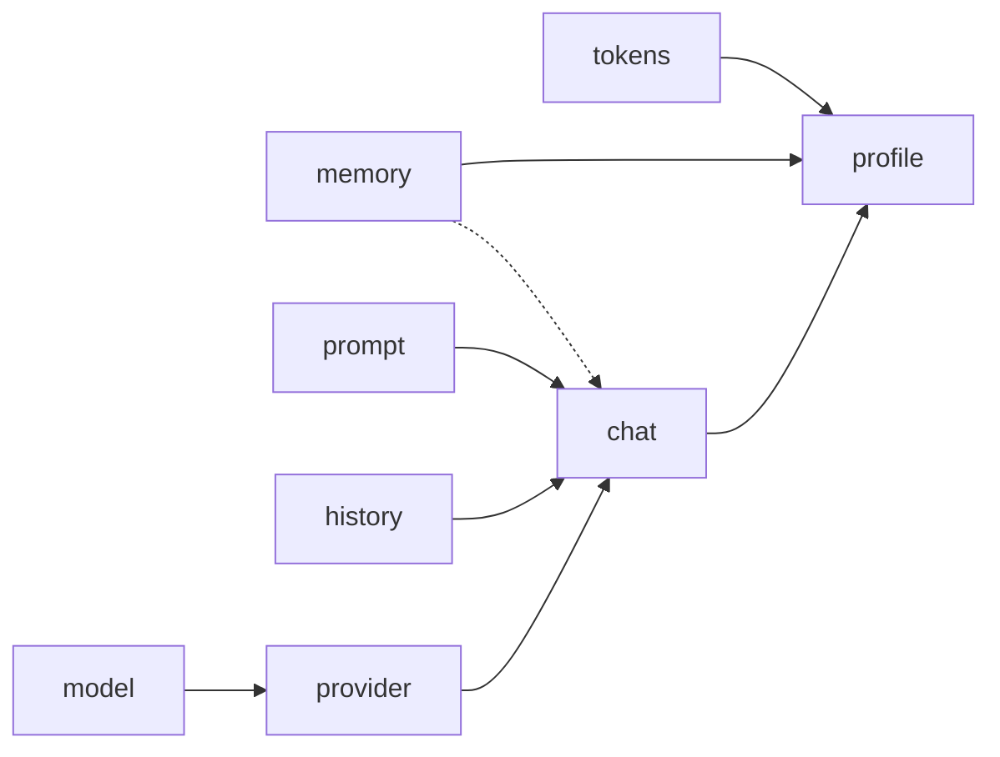

# Documentation

The section contains brief information about [ai-cli](../README.md).

- [profile](profile.md)
- [memory](memory.md)
- [chats](chats.md)
- [prompts](prompts.md)
- [history](history.md)
- [fact](fact.md)
- [models](models.md)
- [architecture](architecture.md)
- [automnenmomorph](automnenmomorph.md)
- [build](build.md)
- [cases](cases.md)
- [config](config.md)
- [token](token.md)
- [index](index.md)
- [provider](provider.md)

# Relationships

