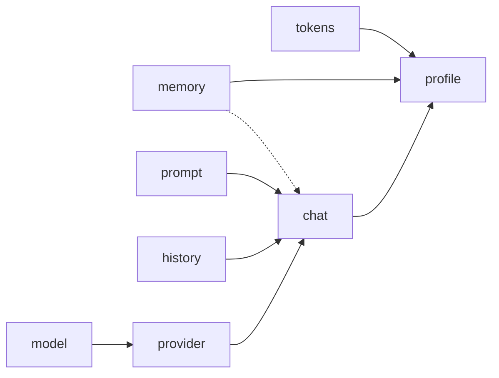

# Documentation

The section contains brief information about [ai-cli](../README.md).

1. [architecture](architecture.md)
0. [profile](profile.md)
0. [provider](provider.md)
0. [memory](memory.md)
0. [chats](chats.md)
0. [prompts](prompts.md)
0. [history](history.md)
0. [fact](fact.md)
0. [config](config.md)
0. [models](models.md)
0. [token](token.md)
0. [completion](completion.md)
0. [build ai-cli](build.md)
0. [cases](cases.md)
0. [automnenmomorph](automnenmomorph.md)

# Relationships

